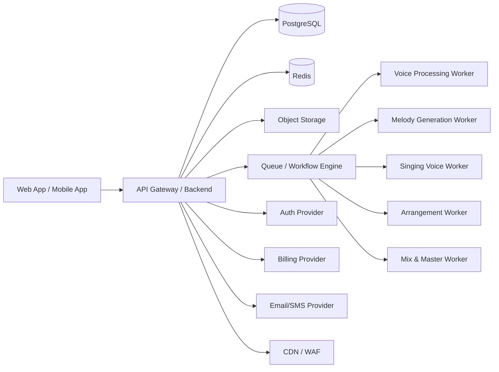

# Arquitetura do Sistema

## Visão Geral
A plataforma utiliza uma arquitetura de monolito modular para o backend principal (API), com workers desacoplados para processamento intensivo de IA e áudio.

## Diagrama de Fluxo (Mermaid)

## Stack Tecnológica
- **Backend:** FastAPI (Python)
- **Frontend:** Next.js + Tailwind CSS
- **Mobile:** React Native + Expo
- **Banco de Dados:** PostgreSQL (Relacional)
- **Cache & Filas:** Redis + Celery / Temporal
- **Storage:** AWS S3 ou Cloudflare R2
- **Infra IA:** Workers com GPU + PyTorch
- **Auth:** Clerk ou Auth0
- **Pagamentos:** Stripe ou Pagar.me

## Domínios Lógicos
1. **Auth & Identity:** Gestão de usuários e permissões.
2. **Voice Profile:** Criação e gestão de clones vocais.
3. **Music Generation:** Geração de melodias e arranjos.
4. **Singing Engine:** Aplicação da voz do usuário à melodia (Inference).
5. **Project Management:** Fluxo de criação e edição de músicas.
6. **Billing & Credits:** Gestão de assinaturas e créditos de uso.
7. **Compliance & Trust:** Auditoria de consentimento e LGPD.
